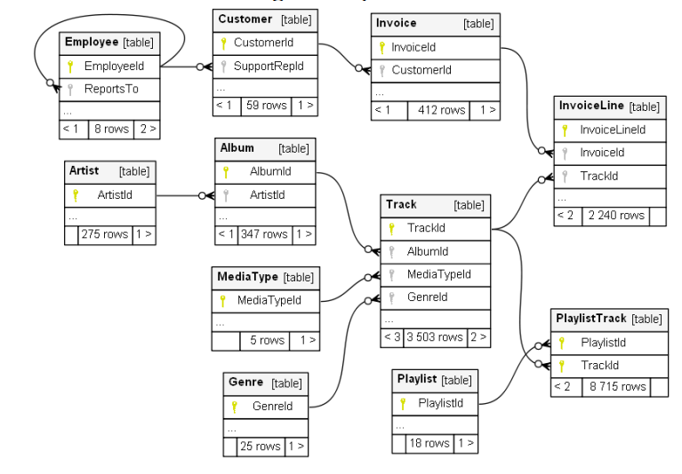

# Topicos Especiales 2
## Tarea 2
### Problema 1

Base	de	Datos	Relacionales	con	Sqlite

Uno	de	los	modelos	de	bases	de	datos	más	utilizados	para	la	enseñanza	de	estructuras	es	el	modelo	de	datos	Chinook.	Representa	
una	tienda	de	medios	digitales,	que	incluye	tablas	para	artistas,	álbumes,	pistas	de	medios,	facturas	y	clientes.	Fue	hecho	usando	
datos	reales	de	una	biblioteca	de	iTunes.	
La	información	de	clientes	y	empleados	se	creó	manualmente	utilizando	nombres	ficticios,	direcciones	que	se	pueden	encontrar	
en	los	mapas	de	Google	y	otros	datos	bien	formateados	(teléfono,	fax,	correo	electrónico,	etc.).	La	información	de	ventas	se	genera	
automáticamente	utilizando	datos	aleatorios	durante	un	período	de	cuatro	años.
El	schema	de	la	base	de	datos	es	como	se	muestra	en	la	figura	abajo:

Descargue	 el	 conjunto	 de	 datos	 chinook de	 <a href="http://www.sqlitetutorial.net/sqlite-sample-database/" target="_blank"> http://www.sqlitetutorial.net/sqlite-sample-database/ </a>o	 el	 archivo	 chinook.db

Usando	la	base	de	datos	chinook,	escriba	un	script	llamado	modifica_chinook.py,	que	hace	lo	siguiente:
1)	Use	los	comandos	de	alterar	tabla	para	crear	una	nueva	tabla	para	subgénero y	llenarla	con	los	subgéneros	de	punk	rock	en	el	
archivo	subgenres.txt.	Esta	 tabla	debe	 tener	un	subgenreid (clave	primaria),	subgenrename,	subgenrealtname	(en	el	caso	de	que	
haya	otro	nombre	para	el	subgénero)	y	un	genreid (clave	foránea)	de	la	tabla	de	género.
2)	Cree	una	nueva	columna	en	las	pistas(tracks)	de	la	tabla	que	permita	al	administrador	de	la	base	de	datos	especificar	un	nuevo	subgénero	
de	la	tabla	que	acaba	de	crear.
3)	Genere	5	nuevas	canciones	en	las Tabla	Track que	tienen	un	subgénero =	”punk	rock”.
